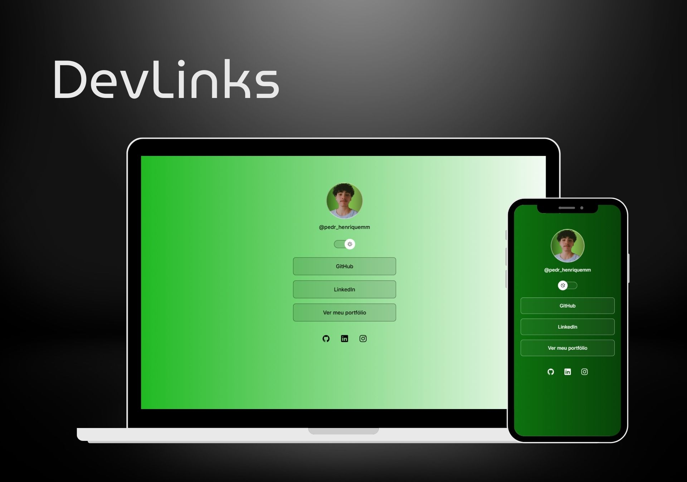

<h1 align="center"> DevLinks </h1>

Programa promovido pela Rocketseat para ensino de tecnologias WEB.

  <a href="#-tecnologias">Tecnologias</a>&nbsp;&nbsp;&nbsp;|&nbsp;&nbsp;&nbsp;
  <a href="#-projeto">Projeto</a>&nbsp;&nbsp;&nbsp;|&nbsp;&nbsp;&nbsp;
  <a href="#-layout">Layout</a>&nbsp;&nbsp;&nbsp;|&nbsp;&nbsp;&nbsp;
  <a href="#memo-licença">Licença</a>

  

 

  

 

## 🚀 Tecnologias

Esse projeto foi desenvolvido com as seguintes tecnologias:

- HTML
- CSS
- JavaScript
- Git e GitHub
- Figma

 

## 💻 Projeto

O DevLinks é um projeto que exibe um lobby com links para as redes sociais e o portfólio do desenvolvedor.

[🔗 Acesse aqui](https://luckzbr.github.io/PH-Lobby/)

 

## 🔖 Layout

Você pode visualizar o layout do projeto através [desse link](https://www.figma.com/community/file/1187422022288947321). É necessário ter conta no [Figma](https://figma.com) para acessá-lo.

 

## :memo: Licença

Esse projeto está sob a licença MIT.

---

By Pedro Henrique
